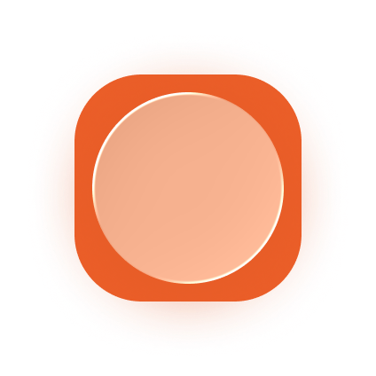

<div align="center">
  

# Dot Cal

**Track your year, goals, journeys, and life with beautiful minimal calendars**

[](https://nextjs.org/)
[](https://www.typescriptlang.org/)
[](https://tailwindcss.com/)
[](https://vercel.com)

[**Live at dotcal.in →**](https://dotcal.in)

[](https://github.com/shivraj-roy/mydotcalendar/actions/workflows/ci.yml)

<a href="https://buymeacoffee.com/shivraj.roy" target="_blank"></a>

</div>

---

## ✨ What is Dot Cal?

Dot Cal generates dynamic wallpapers that visualize your year, goals, journeys, and life as a grid of dots. Each day updates automatically with a new wallpaper showing your progress.

<table>
  <tr>
    <td align="center" width="50%">
      <strong>Year Calendar</strong><br/>
      <br/>
      <em>365 dots. Watch your year unfold dot by dot.</em>
    </td>
    <td align="center" width="50%">
      <strong>Goal Tracker</strong><br/>
      <br/>
      <em>Countdown to your goals. Each dot marks a day.</em>
    </td>
  </tr>
  <tr>
    <td align="center" width="50%">
      <strong>Journey Calendar</strong><br/>
      <br/>
      <em>Satellite map views from start to destination.</em>
    </td>
    <td align="center" width="50%">
      <strong>Life Calendar</strong><br/>
      <br/>
      <em>4,680 dots. Visualize your life, week by week.</em>
    </td>
  </tr>
</table>

---

## 🚀 Features

- **🎨 Four Calendar Types** - Year tracker, goal countdown, journey maps, and life calendar
- **🌍 Live Satellite Imagery** - Powered by Mapbox for journey calendars
- **⚡ Auto-Updates** - Wallpapers refresh daily via macOS Shortcuts automation
- **🎯 Customizable** - Pick colors, set goals, choose dates
- **📱 Responsive** - Works on desktop and mobile browsers
- **🌙 Dark Mode** - Minimal dark design aesthetic
- **⏰ UTC Timezone** - Consistent updates at midnight UTC

---

## 🛠️ Tech Stack

- **Framework:** [Next.js 16](https://nextjs.org/) with App Router & Server Actions
- **Language:** [TypeScript 5](https://www.typescriptlang.org/)
- **Styling:** [Tailwind CSS 4](https://tailwindcss.com/)
- **UI Components:** [Radix UI](https://www.radix-ui.com/) + [Vaul](https://vaul.emilkowal.ski/)
- **SVG → PNG:** [@resvg/resvg-js](https://github.com/yisibl/resvg-js) with embedded fonts
- **Maps:** [Mapbox Static Images API](https://docs.mapbox.com/api/maps/static-images/)
- **Icons:** [Lucide React](https://lucide.dev/)
- **Analytics:** Vercel Analytics, Google Analytics 4, Microsoft Clarity, PostHog
- **Deployment:** [Vercel](https://vercel.com/)

---

## 📦 Getting Started

### Prerequisites

- Node.js 20+ and npm/pnpm/yarn/bun
- Mapbox API token (for journey calendars)

### Installation

```bash
# Clone the repository
git clone https://github.com/shivraj-roy/mydotcalendar.git
cd mydotcalendar

# Install dependencies
npm install

# Set up environment variables
cp .env.example .env.local
# Add your MAPBOX_ACCESS_TOKEN to .env.local

# Run development server
npm run dev
```

Open [http://localhost:3000](http://localhost:3000) to see the app.

---

## 🖼️ Automated Wallpaper Setup (macOS)

Download the included [**Shortcuts file**](./public/assets/DotCal%20Wallpaper%20Shortcut.shortcut) to automatically update your wallpaper daily.

### Setup Instructions

1. Download the shortcut from the website or repository
2. Import it into macOS Shortcuts app
3. Run it **once manually** to set initial wallpaper
4. Enable "Show on all spaces" in System Settings → Wallpaper
5. Set up daily automation in Shortcuts (runs at midnight)

**Note:** Due to macOS limitations, "Show on all spaces" may toggle off after automation runs. [Reported to Apple Developer Forums](https://developer.apple.com/forums/).

---

## 🧑‍💻 Development

```bash
# Run development server with hot reload
npm run dev

# Build for production
npm run build

# Start production server
npm run start

# Lint code
npm run lint
```

### Project Structure

```
mydotcalendar/
├── app/
│   ├── api/
│   │   ├── year/          # Year calendar API endpoint
│   │   ├── goal/          # Goal calendar API endpoint
│   │   ├── journey/       # Journey calendar API endpoint
│   │   └── life/          # Life calendar API endpoint
│   ├── layout.tsx         # Root layout with metadata
│   ├── page.tsx           # Home page
│   ├── robots.ts          # SEO robots configuration
│   └── sitemap.ts         # Dynamic sitemap
├── components/
│   ├── CalendarCard.tsx   # Calendar preview cards
│   └── WallpaperDialog.tsx # Wallpaper generation dialog
├── lib/
│   └── calendar.ts        # Date calculation utilities
├── fonts/
│   └── NotoSansRegular.ttf # Bundled font for SVG rendering
└── public/
    └── assets/            # Images, icons, mockups
```

## License

This project is licensed under **Apache 2.0 with Commons Clause** license. See the [LICENSE](./LICENSE) file for details.

---

<div align="center">

**⭐ Star this repo if you find it helpful!**

</div>
